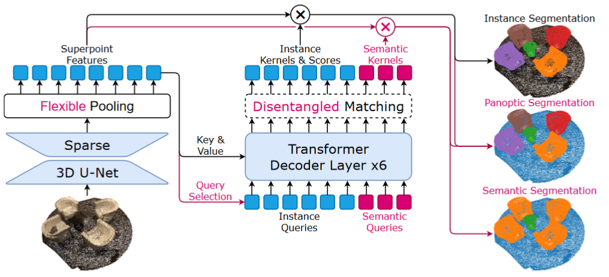

## 相关概念

- Instance Segmentation (实例分割)
- Panoptic Segmentation (全景分割)
- Semantic Segmentation (语义分割)

## 开源评测数据集

- [S3DIS](https://paperswithcode.com/dataset/s3dis): `temp/data/S3DIS` `17G`  （已下载完成）
- [ScanNet](http://www.scan-net.org/): `temp/data/scannetv2` `21G`（已下载完成，前者包含完整未处理数据，后者包含部分数据，但是已经处理过）
- [KITTI](https://www.cvlibs.net/datasets/kitti/): `temp/data/KITTI` `39G`  （已经下载完成）
- [Semantic KITTI](http://www.semantic-kitti.org/): `temp/data/SemanticKITTI` `80G`（已经下载完成）

## 模型改进方法

### 修改点云特征提取器

1. 使用`PointNet++`替代原始网络中的`Sparse 3D U-Net`

    > 原模型参数量：`17515048`，修改后的模型参数量：`8406831`

    > 如何计算模型参数量？
    > 项目中`test/test_cal_params_of_model.py`脚本中的`count_parameters()`函数能够计算传入的模型的总参数量，通过修改`cfg`变量来修改网络架构
    > 执行脚本需要先进入docker容器中的项目文件夹，然后执行命令`python test/test_cal_params_of_model.py`

    实验1：修改多组网络参数，分别进行实验，对比实际测试效果

2. 使用`PointTransformerV2`中的`PointEmbedding`层替代原始网络中的`Sparse 3D U-Net`

3. 使用`PointTransformerV3`中的改进后的`PointEmbedding`层替代原始网络中的`Sparse 3D U-Net`

| Point Cloud Embedding | Sparse 3D U-Net   | PointNet++  | PTV2  | PTV3 |
| ---------- | -------- | ---- | ---- | ---- |
| Parameters | 11624616 |2516400|671496|688360|
| Loss (100 eps) | 3.94 | 8.73 | 6.62 | 7.20 |
| Seg_Loss | 0.163 | 0.380 | 0.480 | 0.495 |
| 其他指标详见论文（在ScanNetV2数据集上的测试结果等） |          |      |      |      |

### 修改损失函数

## 实验结果分析

改进后的模型参数量相较于原来的模型有较多的减少