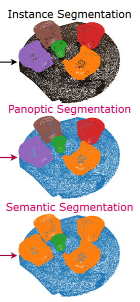

## 相关概念

- Instance Segmentation (实例分割)
- Panoptic Segmentation (全景分割)
- Semantic Segmentation (语义分割)

## 开源评测数据集

- [S3DIS](https://paperswithcode.com/dataset/s3dis): `temp/data/S3DIS` `4.1G`  （已下载完成）
- [ScanNet](http://www.scan-net.org/): `temp/data/scannetv2` `13G`  and `temp/data/scannet_part` `21G`（已下载完成，前者包含完整未处理数据，后者包含部分数据，但是已经处理过）
- [KITTI](https://www.cvlibs.net/datasets/kitti/): `temp/data/KITTI` `78G`  （已经下载完成）
- [Semantic KITTI](http://www.semantic-kitti.org/): `temp/data/SemanticKITTI`（正在下载）